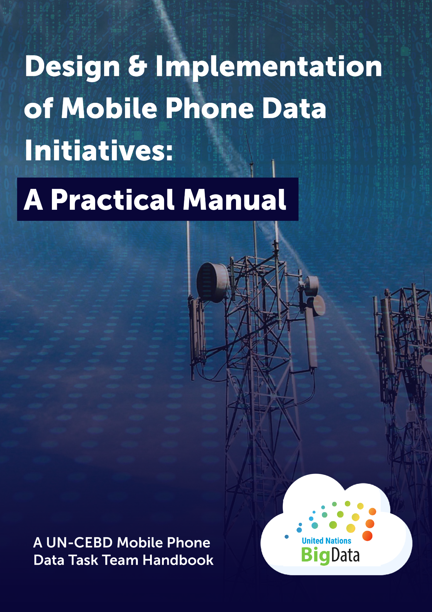

# Preface {.unnumbered}

::: {.content-visible when-format="html"}

  

:::

::: {.callout-note icon="false"}
## Project status

Publisher: United Nations Committee of Experts on Big Data and Data Science for Official Statistics, Mobile Phone Data Task Team. DOI: [10.5281/zenodo.20498954](https://doi.org/10.5281/zenodo.20498954). Except where otherwise noted, this work is licensed under a [Creative Commons Attribution 4.0 International Licence (CC BY 4.0)](https://creativecommons.org/licenses/by/4.0/). The public website is configured for GitHub Pages at <https://un-cebd-mobile-data.github.io/mobile-phone-data-handbook/>.
:::

This handbook provides an in-depth guide to planning and sustaining a Mobile Phone Data (MPD) initiative, with a primary focus on the use of Call Detail Records (CDRs) for public policy, statistical, and development purposes, including operational decision-making. It builds on, and develops further, the concepts and principles first described in the original Handbook on the Use of Mobile Phone Data for Official Statistics released by what was then known as the UN Global Working Group on Big Data for Official Statistics. [@unstats2019mpdhandbook]

The handbook is intended for practitioners working in national statistical offices, telecom regulators, mobile network operators, government ministries, and partner organisations who would like to initiate an MPD initiative. It also contains advice and guidance for those who may already have embarked on the journey of establishing such an initiative but who are searching for more information or guidance on how to do so effectively and sustainably.  It is designed to enable such readers to understand not only the steps involved in planning an MPD initiative, but also the technical, institutional, legal, and ethical reasoning that underpins each decision. It is suitable for both technical and non-technical audiences, and does not assume deep prior technical expertise in MPD analytics.

## Authors {.unnumbered}

Cathy Riley, Francisco Rowe, Esperanza Magpantay, Robert Eyre, Sophie Delaporte, James Harrison, Veronique Lefebvre, Thomas Smallwood, Luisa Chaves, Pablo Ruiz, Maria Henar Sales, Miguel Picornell, Egle Rüütli, Kaisa Vent, Siim Esko, Erki Saluveer, Ayumi Arai, Paul Blanchard, Sveta Milusheva, and Trevor Monroe.

## Recommended citation {.unnumbered}

::: {.callout-note icon="false"}

Riley, C., Rowe, F., Magpantay, E., Eyre, R., Delaporte, S., Harrison, J., Lefebvre, V., Smallwood, T., Chaves, L., Ruiz, P., Sales, M. H., Picornell, M., Rüütli, E., Vent, K., Esko, S., Saluveer, E., Arai, A., Blanchard, P., Milusheva, S., & Monroe, T. (2026). *Design and Implementation of Mobile Phone Data Initiatives: A Practical Manual*. United Nations Committee of Experts on Big Data and Data Science for Official Statistics, Mobile Phone Data Task Team. CC BY 4.0. <https://doi.org/10.5281/zenodo.20498954>. <https://un-cebd-mobile-data.github.io/mobile-phone-data-handbook/>

:::

## Licence {.unnumbered}

Except where otherwise noted, the text of this manual is licensed under a [Creative Commons Attribution 4.0 International Licence (CC BY 4.0)](https://creativecommons.org/licenses/by/4.0/).

This licence does not apply to UN/CEBD logos, trademarks, third-party images, or other third-party material reproduced with permission. Reuse of the manual must not imply endorsement by the authors, the United Nations, UN-CEBD, or affiliated organisations.
